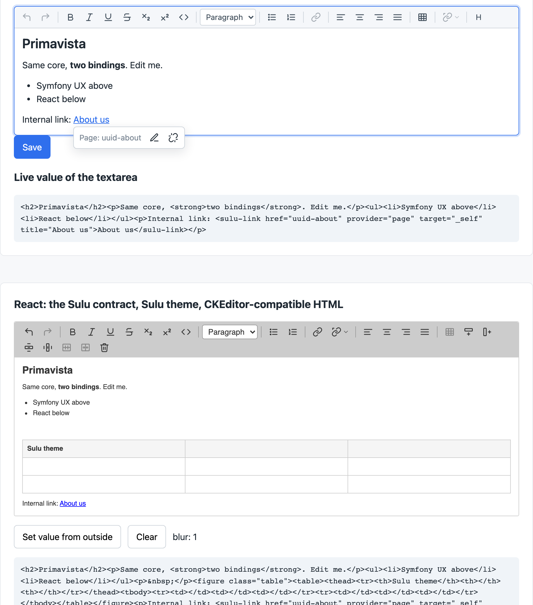

<p align="center">
  
</p>

<h1 align="center">Primavista</h1>

<p align="center">
  A WYSIWYG editor with one framework-free core and two bindings: a Symfony UX bundle for Twig forms and a React component for Sulu Admin.<br>
  HTML in, HTML out. MIT licensed. Built on <a href="https://lexical.dev">Lexical</a>.
</p>

<p align="center">
  <a href="https://github.com/wachterjohannes/primavista/actions/workflows/ci.yml"></a>
  <a href="LICENSE"></a>
  
  
</p>

<p align="center">
  <a href="https://johanneswachter.dev/primavista/"><strong>Live demo</strong></a> ·
  <a href="https://johanneswachter.dev/primavista/docs/"><strong>Documentation</strong></a>
</p>

<p align="center">
  
</p>

*Prima vista*: playing a piece of music at first sight. Open the page and start playing. The name story is in [NAME.md](NAME.md).

## Why

Sulu, and many Symfony projects with it, ship CKEditor 5. Its license got stricter with every release and the bundle grew to half a megabyte. Primavista is the replacement: a small core on Lexical, no license key, plain semantic HTML, and a plugin interface that a CMS can hang its own link and media pickers on. The research behind that decision is in [RESEARCH.md](RESEARCH.md), the decisions in [DECISIONS.md](DECISIONS.md).

## Features

- **Everything is a plugin.** Bold, headings, lists, links, tables and alignment are plugins. Hosts add their own through the same interface.
- **Two bindings, one UI.** The core owns the toolbar. React and Stimulus only mount it, so both look and behave the same.
- **Clean HTML.** No wrapper spans, no inline styles, no editor classes. `p`, `h1` to `h6`, `strong`, `em`, `u`, `s`, `code`, `sub`, `sup`, `a`, lists, tables, `br`. Alignment as `style="text-align"`, text parts in another language as `<span lang>`.
- **CMS links.** Internal links are stored as `<internal-link href="id?query#anchor" provider="page">`, with a dialog hook so the host shows its own resource picker. External links carry target, title and rel. A balloon under the link offers preview, edit and unlink.
- **Sulu drop-in.** `composer require primavista/sulu-bundle` and one import in the admin build replace CKEditor, Sulu itself stays untouched. `@primavista/sulu` keeps every Sulu detail out of the core: `suluPlugins()` builds Sulu's toolbar from a text editor config (Sulu 3.0 params and the 3.1 configs), `<sulu-link>` replaces `<internal-link>`, `suluPreset()` writes CKEditor-compatible markup (`figure.table`, `thead`, `&nbsp;`), the Sulu theme matches the admin, `stripParagraphs` and `wrapParagraphs` cover `enter_mode: br`. Clicked through in a running Sulu Admin, see the [screencast](docs/sulu-integration.md#screencast) and [docs/sulu-integration.md](docs/sulu-integration.md).
- **Typing shortcuts and counts.** `autoformat()` turns `## `, `- `, `1. `, `**bold**` and friends into formatting while typing, limited to what the toolbar offers. `wordCount()` shows words and characters below the content with an optional soft limit.
- **Themes.** All colors and spacings are CSS variables. `themes/dark.css` and the Sulu theme in `@primavista/sulu` ship, a theme is a handful of overrides.
- **Zero build in Symfony.** The Stimulus controller is one self-contained file served by AssetMapper. `composer require`, done.
- **Translatable.** One `translate(key, fallback)` hook covers the toolbar and every form.

## Packages

| Path | Package | What it is |
|---|---|---|
| [`packages/core`](packages/core) | `@primavista/core` | Editor, toolbar, HTML import and export, plugin API. No framework. |
| [`packages/react`](packages/react) | `@primavista/react` | `<Editor value onChange onBlur />`, a thin mount wrapper. React 17 to 19. |
| [`packages/sulu`](packages/sulu) | `@primavista/sulu` | Sulu flavour: `suluPlugins()`, `<sulu-link>`, CKEditor-compatible preset, Sulu theme, `enter_mode` helpers. |
| [`bundles/ux-bundle`](bundles/ux-bundle) | `primavista/ux-bundle` | Symfony bundle: `PrimavistaType` form type plus a Stimulus controller. |
| [`bundles/sulu-bundle`](bundles/sulu-bundle) | `primavista/sulu-bundle` | Sulu bundle: registers Primavista as the `text_editor` adapter of Sulu Admin, no change to Sulu needed. |
| [`demo`](demo) | | Symfony app that renders both bindings on one page. Target of the browser tests. |
| [`pages`](pages) | | Static demo published to [GitHub Pages](https://johanneswachter.dev/primavista/). |
| [`e2e`](e2e) | | Playwright suite against the demo. |
| [`docs`](docs) | | Research, decisions, Sulu requirements and the Sulu adapter. |

## Quick start

Requirements: Node 20+, pnpm 10, PHP 8.4, Composer.

```sh
pnpm install
pnpm build                      # core, react, sulu, bundle controller, demo island
pnpm test                       # Vitest: core, react and sulu
(cd bundles/ux-bundle && composer install && composer test && composer phpstan)
(cd bundles/sulu-bundle && composer install && composer test && composer phpstan)
(cd demo && composer install)
pnpm e2e:install                # downloads Chromium once
pnpm e2e                        # starts php -S on 127.0.0.1:8799 and runs Playwright
```

The static demo that GitHub Pages serves builds with `pnpm build:pages` into `pages/dist`. To look at the Symfony demo by hand:

```sh
php -S 127.0.0.1:8799 -t demo/public demo/public/router.php
```

## Using the core

```ts
import { createEditor } from '@primavista/core';
import '@primavista/core/primavista.css';

const editor = createEditor(document.querySelector('#host'), {
  initialHtml: '<p>Hello</p>',
  placeholder: 'Write…',
  theme: 'dark',                 // optional, needs themes/dark.css
});
editor.on('change', (html) => console.log(html));
editor.getHtml();
editor.setHtml('<h1>Replaced</h1>');
editor.destroy();
```

`createEditor` takes a `plugins` array. Without it, `defaultPlugins()` is used: history, formatting (bold, italic, underline, strikethrough, subscript, superscript, code), headings, lists, links, alignment, tables (with merge and split) and autoformat. For a CMS add `internalLinks({ providers })`, for multilingual text `language({ languages })`, for a status bar with counts `wordCount()`.

## Plugins

A plugin declares Lexical nodes, theme classes, toolbar items and a `register` hook:

```ts
import { lexical, type PrimavistaPlugin } from '@primavista/core';

const { $getSelection, $isRangeSelection, FORMAT_TEXT_COMMAND } = lexical;

export const highlight: PrimavistaPlugin = {
  name: 'highlight',
  toolbar: [
    {
      id: 'highlight',
      label: 'Highlight',
      icon: '<svg …>',
      isActive: () => {
        const selection = $getSelection();
        return $isRangeSelection(selection) && selection.hasFormat('highlight');
      },
      onClick: (editor) => editor.dispatchCommand(FORMAT_TEXT_COMMAND, 'highlight'),
    },
  ],
};
```

`isActive`, `isDisabled`, `isHidden` and `getValue` run inside `editor.read()`, so the `$` helpers work. Toolbar items are buttons, native selects or menus. `register(context)` runs once after mount and returns a cleanup function. `context.toolbar.openPanel()` shows a second toolbar row, `context.balloon.show()` a floating panel under an element in the content.

A plugin declares what it offers in `allows` (`headings`, `lists`, `formats`, `alignments`), and every plugin gets the merged result as `context.allowed`. `autoformat` and paste cleanup follow it, so a replaced `headings({ levels: ['h2', 'h3'] })` also limits the typed shortcuts. Spreading a plugin keeps the declaration.

### Autoformat

`autoformat()` converts Markdown while typing: `## ` at the start of a paragraph makes a heading, `- ` or `* ` a bullet list, `1. ` a numbered list, `**bold**`, `*italic*`, `***both***`, `~~strike~~` and `` `code` `` the inline formats. It only produces what the other plugins offer: `headings({ levels: ['h2', 'h3'] })` leaves `# ` as text, `lists({ types: ['ol'] })` leaves `- `, `formatting({ formats: ['bold'] })` leaves `*italic*`. Undo turns a conversion back into the typed characters. Loaded or pasted HTML is never touched.

```ts
autoformat();                   // part of defaultPlugins()
autoformat({ blocks: false });  // inline formats only
autoformat({ inline: false });  // headings and lists only
```

It is on in `defaultPlugins()` and off in `suluPlugins()`, where `autoformat: true` switches it on. Links, quotes and code blocks have no shortcut.

### Word count

`wordCount()` adds a status bar below the content with the number of words and characters. It lives outside the editable element and never reaches the HTML.

```ts
wordCount({
  mode: 'both',                  // 'words', 'characters' or 'both'
  limit: 300,                    // soft limit, marks the bar, never blocks typing
  limitBy: 'words',              // defaults to characters in 'characters' mode, words otherwise
  onChange: ({ words, characters, overLimit }) => {},
});

getWordCount(editor);            // { words, characters }, with or without the plugin
countText('Some plain text');    // the same rules on a string
```

Characters include spaces but not the breaks between blocks, an emoji is one character. Every Chinese or Japanese ideograph and kana counts as one word, the way word processors count. Over the limit the bar gets `pv-word-count--over` and a polite live region announces it once, the counts themselves are not announced on every keystroke. Labels translate through `wordCount.words`, `wordCount.characters` and `wordCount.overLimit`.

With a bundler, import from `lexical` directly. In the Symfony UX build the core re-exports `lexical`, `lexicalLink` and `lexicalUtils`, because the controller ships its own copy of Lexical.

## Link dialogs

Both link plugins ask the host for a dialog instead of forcing their own UI:

```ts
links({ openDialog: (state) => myLinkModal(state) });          // state.apply({ url, target, title, rel, text })
internalLinks({
  providers: [{ key: 'page', label: 'Page' }, { key: 'media', label: 'Media' }],
  openDialog: (state) => myResourcePicker(state),               // state.apply({ href, query, anchor, target, title, text })
});
```

`state` carries the current values, `mode` (`create` or `edit`), the selected text and `collapsed`. With a collapsed selection `apply` inserts `text` (or the URL) as link text. Without `openDialog` a compact form appears in the toolbar. The demo's React island shows a host dialog.

## React

```tsx
import { Editor } from '@primavista/react';
import { suluPlugins, suluPreset } from '@primavista/sulu';
import '@primavista/core/primavista.css';
import '@primavista/sulu/sulu.css';

<Editor value={html} onChange={setHtml} onBlur={markTouched} plugins={suluPlugins({ providers })} {...suluPreset()} />
```

The props match what Sulu's `fieldRegistry.add()` expects. `plugins`, `theme`, `html` and `translate` are read once on mount. Pass a `key` to remount with another set.

## Symfony UX

```sh
composer require primavista/ux-bundle
```

```php
use Primavista\UxBundle\Form\PrimavistaType;

$builder->add('body', PrimavistaType::class, [
    'placeholder' => 'Start writing…',
    'theme' => 'dark',
]);
```

The field renders a textarea with the Stimulus controller `primavista--ux-bundle--editor`. The controller mounts the editor next to it and keeps the textarea value in sync, so the form posts plain HTML. On submit, `symfony/html-sanitizer` drops everything the editor does not emit itself: scripts, event handlers, `javascript:` URLs, foreign styles and unknown elements. The browser ships no sanitizer, the server is the trust boundary. Apps hook in through `primavista:pre-connect` (add plugins, the event carries the core module) and `primavista:connect` (the editor instance). Details in the [bundle README](bundles/ux-bundle/README.md).

## Themes

Every color and spacing is a custom property on `.pv-editor`. A theme is a stylesheet that scopes overrides to `.pv-editor.pv-theme-<name>`:

```css
.pv-editor.pv-theme-brand {
  --pv-accent: #e11d48;
  --pv-toolbar-bg: #fff1f2;
}
```

Activate it with `theme: 'brand'`. `@primavista/sulu/sulu.css` reproduces Sulu Admin, `themes/dark.css` is a dark variant.

## Translations

`createEditor(host, { translate: (key, fallback) => t(key) ?? fallback })` translates toolbar labels (`toolbar.<id>`, `toolbar.<id>.<option>`), the link forms (`link.url`, `link.target`, `link.add`, …) and the word count (`wordCount.words`, `wordCount.characters`, `wordCount.overLimit`). The React component takes the same `translate` prop. The full key set with English and German strings is in [docs/sulu/translations](docs/sulu/translations).

## Sizes

| File | Size | Gzip |
|---|---|---|
| `bundles/ux-bundle/assets/dist/controller.js` (core, Lexical, tables, links) | 404 KB | 126 KB |
| `packages/core/dist/index.js` (Lexical external, not minified) | 78 KB | 18 KB |
| `packages/sulu/dist/index.js` (not minified) | 4 KB | 2 KB |

`pnpm size` checks these files against a budget after `pnpm build`, CI fails when one grows past it. What the controller contains is in decision 34 of [DECISIONS.md](DECISIONS.md).

## Documentation

- [docs/sulu-integration.md](docs/sulu-integration.md): replacing CKEditor 5 in Sulu Admin with the bundle, step by step, with a screencast.
- [docs/sulu-requirements.md](docs/sulu-requirements.md): what Sulu uses from CKEditor, read from the source.
- [bundles/sulu-bundle](bundles/sulu-bundle): the Sulu bundle with the adapter and its Jest test.
- [RESEARCH.md](RESEARCH.md): the editor landscape and the Symfony UX conventions.
- [DECISIONS.md](DECISIONS.md): what was decided, what was rejected, what is open.
- [CONTRIBUTING.md](CONTRIBUTING.md): setup and ground rules.

## License

[MIT](LICENSE)
